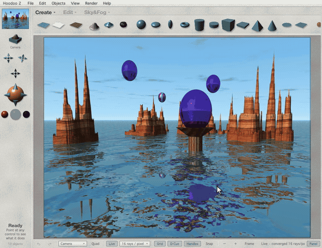
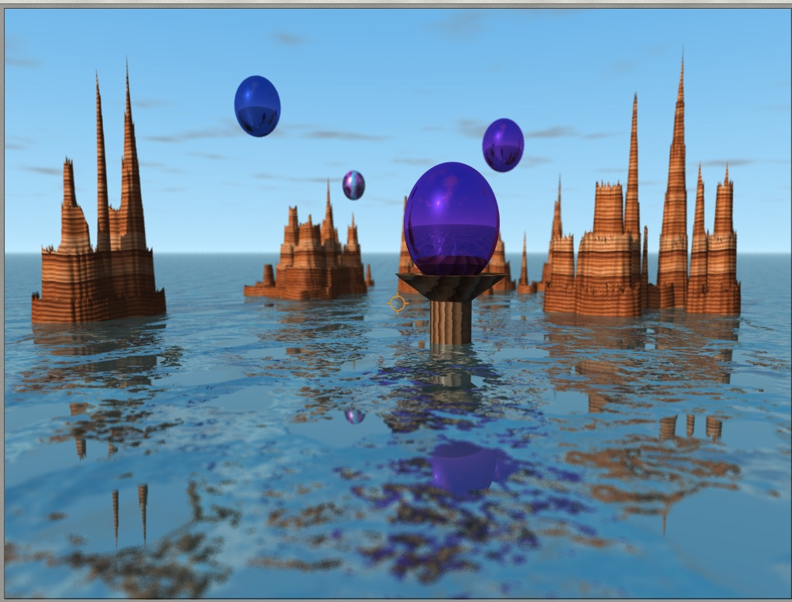
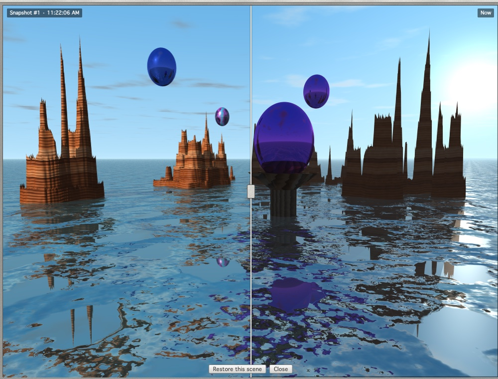
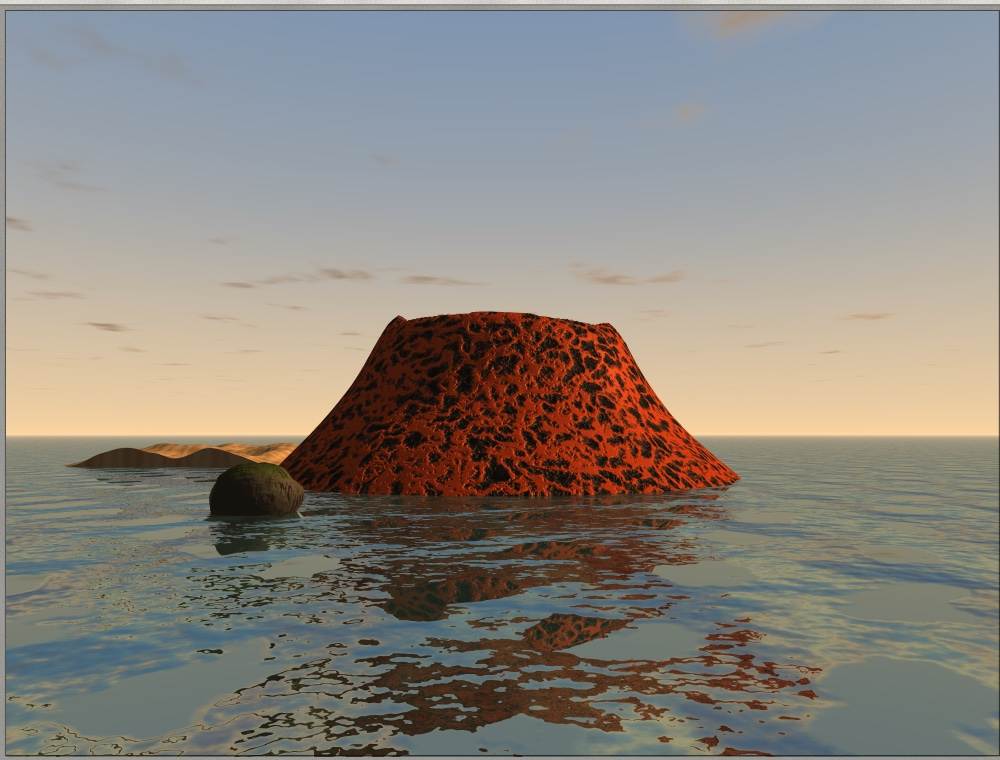
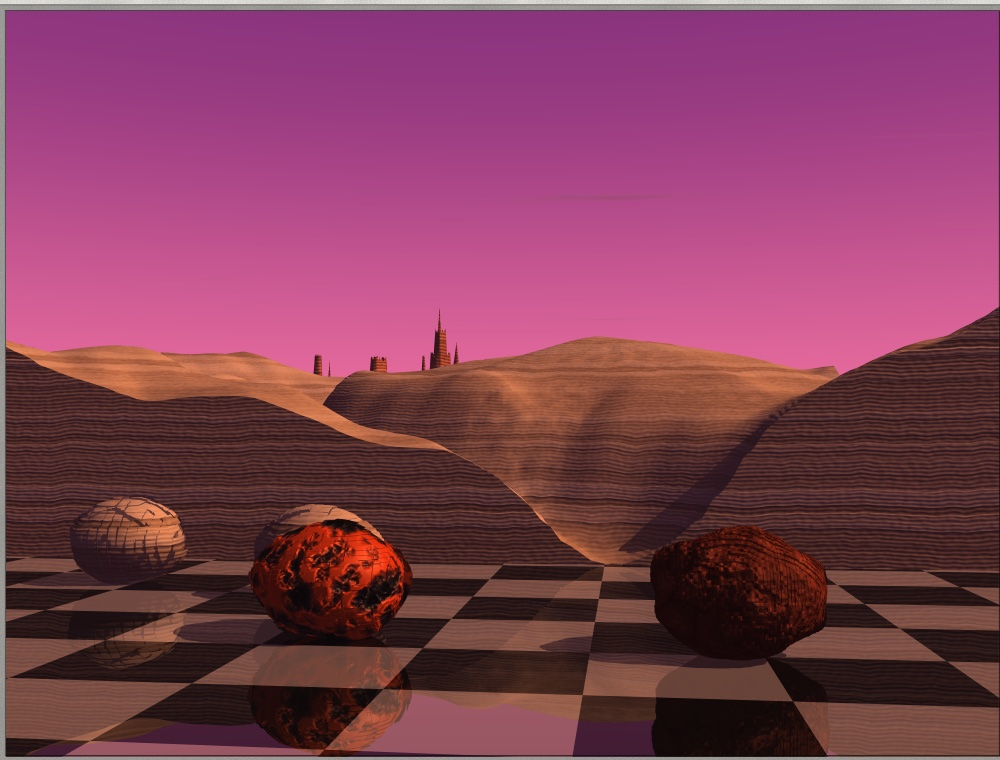

# Hoodoo 2

**A Bryce 2–style 3D landscape studio that runs in the browser.**

Hoodoo recreates the workflow and the look of MetaTools Bryce 2 (1996): the
stone-grey interface, the wireframe scene window, the camera trackball, the
Materials Lab, the Terrain Editor, Sky & Fog, and a ray tracer that paints the
picture block by block. It adds the conveniences a modern editor is expected
to have — undo history, live rendering, depth of field, snapshots, movies,
offline use.

**Live:** https://hoodoo.myfunc.io/



## Features

### From Bryce 2

- **Interface:** generated stone-paper chrome, embossed *Create / Edit / Sky&Fog*
  titles with preset triangles, ray-traced teal object icons on a shelf whose
  lip scrolls them when the window is narrow, the left column with nano
  preview, the view platform, three salmon camera crosses, the trackball dome
  and chrome render balls, hint text, and the dark lab windows. Every icon is
  rendered by the app itself at load time.
- **Splash screen:** an art-filled welcome window while the app loads, showing
  *Planet Meadows* — a Hoodoo scene (`src/world/splash-scene.ts`) rendered in
  Hoodoo by `node tools/make-splash.mjs`.
- **Scene window:** wireframe lattices with depth cue, ground grid, horizon,
  red selection, the A / M / E tag beside the selection, document-aspect frame.
- **Render:** a progressive GPU ray tracer that draws like Bryce — 16×16 down
  to 2×2 blocks, then anti-aliasing — with primitives, boolean groups, terrains
  and symmetrical lattices, stones, infinite planes, lights, shadows,
  reflection, refraction, bump, 13 procedural textures and the Bryce sky with
  clouds, haze, fog and stars. See [docs/rendering.md](docs/rendering.md).
- **Editors:** Materials Lab (colour and value channels driven by three
  textures, preset library), Terrain Editor (elevation and filter tools, grid
  resolution, paint brush, height-map import and export), Sky & Fog palette,
  Object Attributes, Edit palette (resize / rotate / reposition, align,
  randomize, land), Object Library, Document Setup.

### Modern additions

1. Unlimited undo and redo with a clickable history.
2. Live ray-traced viewport: real-time while you move, refining when you stop.
3. Orbit, pan and dolly navigation, right-drag + WASD fly, frame selection.
4. Move handles with grid snapping and a numeric Attributes panel.
5. Scene outliner: select, rename, hide, lock.
6. Autosave, `.hoodoo` scene files, drag and drop to open.
7. Share links that carry the whole scene.
8. Tiled high-resolution PNG export and copy to clipboard.
9. Command palette (Ctrl/Cmd+K) with every action and its shortcut.
10. Four-view layout and a free Director's View.
11. Nine camera bookmarks.
12. Height-map import and export, terrain paint brush.
13. Random materials, random skies, Multi-Replicate.
14. **Depth of field** with click-to-focus (Alt+F).
15. **Snapshots** with an A/B compare slider and one-click restore (B, Shift+B).
16. **Surprise Me:** a whole random landscape from one seed (Alt+Shift+N).
17. **Movies:** turntable, swing, fly-in and sunrise time-lapse, saved as WebM.
18. **Offline and installable** as an app.

| Depth of field | Snapshot compare |
|---|---|
|  |  |

| Surprise Me | Surprise Me |
|---|---|
|  |  |

## Getting started

Requires Node.js 20 or newer.

```bash
npm ci
npm run dev        # http://localhost:5640
```

Other commands are in [CONTRIBUTING.md](CONTRIBUTING.md): tests, lint, build,
and the headless tools used to measure rendering and start-up.

### Browser support

Any browser with WebGL 2 and float render targets: current Chrome, Edge,
Firefox and Safari. Movie export needs WebCodecs with VP8 or VP9 (Chrome, Edge,
Firefox). On the first visit the ray tracer is compiled for the local GPU —
a fraction of a second on macOS, several seconds with Direct3D on Windows; a
card in the scene window shows the progress, and the editor can be used in the
meantime. Later visits reuse the compiled program.

## How it is built

TypeScript, Vite and WebGL 2, no runtime dependencies. The code is split into
layers that only import downwards (enforced by ESLint):

```
core → model → assets → world → render / io → input → ui → app
```

| Layer | Contents |
|---|---|
| `core` | vectors, matrices, colour, event bus, logger, seeded random numbers, key names |
| `model` | scene types and enums, branded ids, material factory |
| `assets` | presets as data: materials, skies, objects, terrain recipes |
| `world` | the `World` (immutable scene snapshots, undo, gestures), terrain operations, camera math, transforms, scene files and validation, the landscape generator |
| `render` | the GPU engine, classic and live renderers, thumbnails, tiled export, wireframe |
| `io` | project files, autosave, share links, image export, WebM muxer and encoder |
| `input` | actions, key bindings, the scene-window pointer state machine |
| `ui` | the UI kit, the Bryce chrome, labs and side panels |
| `app` | composition root, commands, service worker registration |

### Scene files and links

A `.hoodoo` file is JSON (`format: "hoodoo-scene"`, `version: 1`); terrain
heights are stored as base64 16-bit samples. A share link holds the same JSON,
deflated, in the URL fragment, so it never reaches a server.

## Deploying

`npm run build` produces static files with relative paths; host `dist/` on any
web server, at the root or under a sub-path. The response headers live in
`public/_headers` and [SECURITY.md](SECURITY.md) explains them.

- **Cloudflare Workers** (the public instance): `npm run deploy` builds and
  uploads `dist/` as static assets with those headers; no Worker code runs, so
  it fits the free plan. Change the route in `wrangler.jsonc` to host your own
  copy, or set `"workers_dev": true` for a free `*.workers.dev` address.
- **nginx:** `deploy/nginx.conf` is a sample site with the same headers.
- **Anything else:** `npm run serve:dist` previews a build with the production
  headers, so a host that cannot send them is easy to compare against.

## Credits

Bryce is a trademark of DAZ 3D. Bryce 2 was created by Kai Krause and Eric
Wenger at MetaTools (1996). Hoodoo is an independent tribute, not affiliated
with or endorsed by DAZ 3D or the original authors, and contains none of their
code or assets. The name comes from the rock spires of Bryce Canyon.

## License

[MIT](LICENSE)
